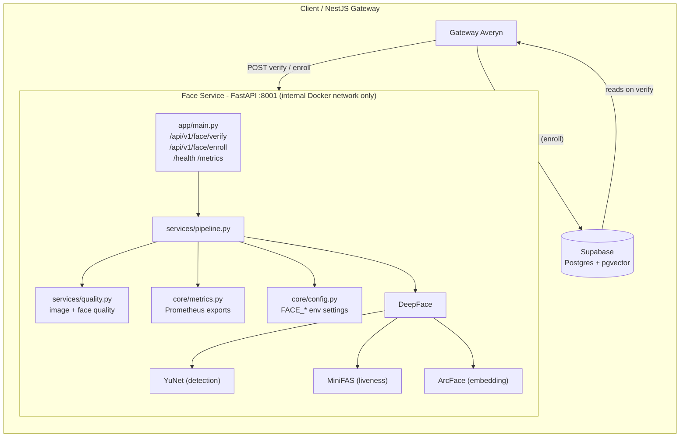

# Averyn - Face Service

Face recognition microservice of **Averyn**, the institutional platform for identity,
biometrics and artificial intelligence for the secure management of institutional
processes in organizations.

> **Status: POC (Proof of Concept)** - This project is a proof of concept.
> The face verification pipeline works: quality, liveness, 1:1 verification and
> enrolment are exposed over HTTP. It is **not production-ready**: embeddings
> persistence (Postgres/Supabase + pgvector), biometric data protection, threshold
> calibration and the NestJS gateway integration are still pending. See
> [Production roadmap (pending)](#production-roadmap-pending).

A [FastAPI](https://fastapi.tiangolo.com/) face recognition microservice that runs a
**1:1 verification** pipeline: capture quality -> face detection + anti-spoofing ->
embedding -> comparison against a previously registered embedding.

Built on [DeepFace](https://github.com/serengil/deepface) and designed to run on
**CPU** (no GPU required) inside Docker.

## Features

- **Image quality**: rejects dark, overexposed or blurry captures (configurable thresholds).
- **Face quality**: rejects multiple faces and faces that are too small.
- **Anti-spoofing (liveness)**: distinguishes real photos from screens or printed photos (MiniFAS).
- **ArcFace embeddings** (512-dim) with cosine-similarity verification.
- **Enrolment endpoint**: `POST /api/v1/face/enroll` returns the 512-dim embedding after
  the same quality + liveness checks used for verification.
- **Optimized**: detection + liveness in a single pass; the embedding is computed without re-detecting.
- **Non-blocking concurrency**: CPU-bound work runs in the threadpool; an inference lock keeps
  DeepFace models safe, and a semaphore returns explicit `503` instead of silently degrading.
- **Observability**: Prometheus metrics per pipeline stage, structured JSON logs,
  basic and detailed health checks.
- **Configuration via environment variables** (`FACE_*`) instead of hardcoded thresholds.
- **Model warm-up** on startup and during the Docker build (runtime starts with no internet access).
- **CPU-only Docker image** ready for resource-constrained hardware.

## Architecture



### Models

| Model | Purpose |
|---|---|
| **YuNet** (OpenCV) | Face detection (chosen for speed) |
| **ArcFace** | 512-dimensional embeddings |
| **MiniFAS** | Liveness / anti-spoofing |

## Getting Started

### Local (Python 3.11)

```bash
git clone https://github.com/ddturizo-eng/face-service.git
cd face-service
python -m venv venv
venv\Scripts\activate        # Windows  |  source venv/bin/activate (Linux/macOS)
pip install -r requirements.txt
uvicorn app.main:app --port 8001
```

> The first run downloads the models (~1-2 GB) into `~/.deepface` or `$DEEPFACE_HOME`;
> the service warm-ups all models on startup (~10-15 s). To scale, add `--workers N`
> (each worker loads its own copy of the models).

### Docker

```bash
docker build -t averyn-face-service .
docker run -p 8001:8001 averyn-face-service
```

> Models are downloaded and cached inside the image at build time, so the container
> starts without any internet dependency.

## API

The full contract (payloads, error codes, SLA, timeouts) is documented in
[`CONTRACT.md`](CONTRACT.md). Interactive docs: `/docs` (Swagger UI).

### `GET /health`

Basic liveness check for the container orchestrator:

```json
{ "status": "ok" }
```

### `GET /api/v1/face/health`

Detailed check: confirms the AI models are loaded and the service can process requests:

```json
{ "status": "healthy", "models_loaded": true, "concurrent_max": 1 }
```

### `GET /metrics`

Prometheus metrics (HTTP traffic + per-stage pipeline histograms).

### `POST /api/v1/face/enroll`

Generates the 512-dim embedding for a capture after quality + liveness checks.
**Returns the embedding** so the caller can store it (e.g. in Supabase/pgvector).
Internal endpoint; do not expose to the public internet.

```json
{
  "success": true,
  "data": {
    "faceDetected": true,
    "faceCount": 1,
    "qualityOk": true,
    "qualityIssues": [],
    "isLive": true,
    "livenessConfidence": 0.99,
    "embedding": [0.0012, -0.0345, "..."]
  },
  "meta": { "model": "ArcFace", "detector": "yunet", "processingTimeMs": 412.3 },
  "error": null
}
```

### `POST /api/v1/face/verify`

`multipart/form-data`:

| Field | Type | Required | Description |
|---|---|---|---|
| `imagen` | file | Yes | Photo to analyze |
| `embedding_registrado` | text | No | JSON array of floats (the registered person's embedding) |

**Response:**

```json
{
  "success": true,
  "data": {
    "faceDetected": true,
    "faceCount": 1,
    "qualityOk": true,
    "qualityIssues": [],
    "isLive": true,
    "livenessConfidence": 0.99,
    "similarity": 0.8321,
    "verified": true
  },
  "meta": { "model": "ArcFace", "detector": "yunet", "processingTimeMs": 412.3 },
  "error": null
}
```

**Early-rejection codes** (all return `verified: null`, HTTP 200 because the
pipeline ran correctly):

| `qualityIssues` | Reason |
|---|---|
| `resolucion_insuficiente (WxH)` | Image smaller than 200x200 px |
| `imagen_muy_oscura` / `imagen_sobreexpuesta` | Mean brightness outside [60, 200] |
| `imagen_borrosa` | Laplacian variance < 20 |
| `ningun_rostro_detectado` | No face found |
| `multiples_rostros_detectados (N)` | More than one face in the image |
| `rostro_muy_pequeno` | Face < 5% of image area or < 50 px wide |

**HTTP error codes:**

| Code | Meaning | Retry? |
|---|---|---|
| `400` | Invalid parameter (e.g. malformed `embedding_registrado`) | No |
| `422` | Missing/invalid multipart field (FastAPI validation) | No |
| `503` | Capacity exhausted (semaphore full) | Yes, backoff |
| `500` | Unexpected technical error | Yes, once, then alert |

### Example with curl

```bash
# Verify against a registered embedding
curl -X POST http://localhost:8001/api/v1/face/verify \
  -F "imagen=@path/to/photo.jpg" \
  -F "embedding_registrado=[0.0012,-0.0345,...]"   # 512 floats

# Enrol: returns the embedding
curl -X POST http://localhost:8001/api/v1/face/enroll \
  -F "imagen=@path/to/photo.jpg"
```

## Configuration

All settings are loaded from environment variables with the `FACE_` prefix
([`app/core/config.py`](app/core/config.py), pydantic-settings). Example:

```bash
FACE_SIMILARITY_THRESHOLD=0.70 uvicorn app.main:app --port 8001
```

| Variable | Default | Description |
|---|---|---|
| `FACE_MODEL_NAME` | `ArcFace` | Embedding model |
| `FACE_DETECTOR_BACKEND` | `yunet` | Face detector |
| `FACE_SIMILARITY_THRESHOLD` | `0.68` | Verification (cosine) - **not calibrated** |
| `FACE_MAX_CONCURRENT_REQUESTS` | `1` | Concurrent requests per worker (models are not thread-safe; scale with `--workers`) |
| `FACE_BRILLO_MIN` / `FACE_BRILLO_MAX` | 60 / 200 | Image quality |
| `FACE_NITIDEZ_MIN` | 20.0 | Image quality (Laplacian) |
| `FACE_ANCHO_MIN` / `FACE_ALTO_MIN` | 200 / 200 | Minimum resolution (px) |
| `FACE_ROSTRO_AREA_MIN_RATIO` | 0.05 | Face quality |
| `FACE_ROSTRO_ANCHO_MIN_PX` | 50 | Face quality |
| `FACE_HOST` / `FACE_PORT` | `0.0.0.0` / `8001` | Listen address |

> **Note:** Thresholds are **starting values** and `SIMILARITY_THRESHOLD` is DeepFace's
> documented default; recalibrate with real data (FAR/FRR) using
> [`calibrate.py`](calibrate.py) before production.

## Load testing

[`LOAD_TEST_REPORT.md`](LOAD_TEST_REPORT.md) contains real measured numbers
(throughput, P50/P95/P99, resource usage, degradation point) and the
[`locustfile.py`](locustfile.py) used to reproduce them.

## Test scripts

- [`test_comparacion_detectores.py`](test_comparacion_detectores.py) - compares
  RetinaFace vs. YuNet on pairs from the LFW dataset (requires downloading
  [LFW](https://vis-www.cs.umass.edu/lfw/) into `test_images/lfw_funneled`).

## Structure

```
app/
+-- main.py                     # API: /health, /api/v1/face/(health|enroll|verify), /metrics
+-- core/
|   +-- config.py               # Env-driven settings and thresholds
|   +-- metrics.py              # Prometheus metrics
|   +-- logging_config.py       # Structured JSON logging
+-- schemas/
|   +-- face.py                 # Response schemas
+-- services/
|   +-- pipeline.py             # Pipeline orchestration
|   +-- quality.py              # Image and face quality
calibrate.py                    # FAR/FRR threshold calibration tool
locustfile.py                   # Load test scenarios
loadtest_results/               # Locust CSV results (gitignored)
dockerfile                      # CPU-only image with preloaded models
requirements.txt                # Dependencies
warmup.py                       # Download/cache models at Docker build time
SECURITY.md                     # Biometric data handling and protections
CONTRACT.md                     # API contract for the NestJS gateway
```

## Privacy note

`test_images/` is **excluded** from version control (`.gitignore` / `.dockerignore`)
because it may contain real face photos, which are sensitive personal data.
**Never commit real photos or any other sensitive or anonymizable data to this repo.**

See [`SECURITY.md`](SECURITY.md) for how biometric data (embeddings) is handled,
where it is stored, who can read it and how it is deleted.

## Production roadmap (pending)

- **Database**: no persistence yet; planned to store embeddings in Postgres
  (Supabase) with `pgvector` (the gateway stores the embeddings returned by `/enroll`).
- **Biometric data protection**: RLS and deletion flows in Supabase, authentication
  between gateway and face-service, TLS at deployment.
- **Threshold calibration** with real data (FAR/FRR) - tooling in `calibrate.py`.
- **NestJS gateway integration** using the frozen contract in `CONTRACT.md`.
- **Automated tests** and CI.

## License

MIT - see [LICENSE](LICENSE).